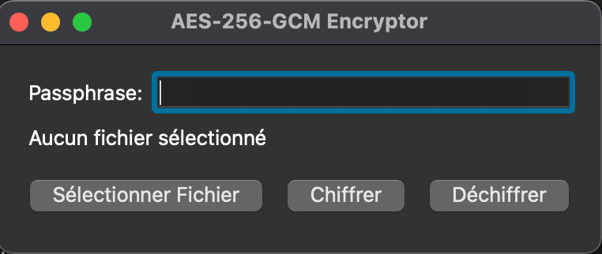

# Guide Utilisateur - AES-256-GCM Encryptor

## Table des matières
1. [Introduction](#introduction)
2. [Installation](#installation)
3. [Interface Graphique](#interface-graphique)
4. [Interface en Ligne de Commande](#interface-en-ligne-de-commande)
5. [Bonnes Pratiques de Sécurité](#bonnes-pratiques-de-sécurité)
6. [Dépannage](#dépannage)

## Introduction

AES-256-GCM Encryptor est une application de chiffrement sécurisée qui vous permet de protéger vos fichiers sensibles en utilisant l'algorithme de chiffrement AES-256 en mode GCM. L'application est disponible en deux versions :
- Une interface graphique (GUI) facile à utiliser
- Une interface en ligne de commande (CLI) pour l'automatisation

## Installation

### Prérequis système
- macOS 10.15 ou plus récent
- 512 Mo de RAM minimum
- 100 Mo d'espace disque

### Procédure d'installation

1. **Version GUI**
   - Double-cliquez sur `encryptor-gui.app`
   - Lors du premier lancement, autorisez l'application dans Préférences Système > Sécurité

2. **Version CLI**
   - Ouvrez un terminal
   - Naviguez vers le dossier contenant `encryptor-cli.app`
   - Exécutez : `./encryptor-cli.app/Contents/MacOS/encryptor-cli`

## Interface Graphique

### Chiffrement d'un fichier
1. Lancez l'application `encryptor-gui`
2. Cliquez sur "Chiffrer un fichier"
3. Sélectionnez le fichier à chiffrer
4. Choisissez l'emplacement du fichier chiffré
5. Entrez un mot de passe sécurisé
6. Confirmez le mot de passe
7. Cliquez sur "Démarrer le chiffrement"

### Déchiffrement d'un fichier
1. Lancez l'application `encryptor-gui`
2. Cliquez sur "Déchiffrer un fichier"
3. Sélectionnez le fichier chiffré (.aes)
4. Choisissez l'emplacement du fichier déchiffré
5. Entrez le mot de passe
6. Cliquez sur "Démarrer le déchiffrement"

### Interface principale

1. Barre de menu
   - Fichier : Nouveau, Ouvrir, Quitter
   - Options : Préférences
   - Aide : À propos, Documentation
2. Zone principale
   - Boutons de sélection du mode
   - Zone de dépôt de fichiers
   - Champ de mot de passe
3. Barre de statut
   - Progression de l'opération
   - Messages d'état

## Interface en Ligne de Commande

### Syntaxe de base
```bash
# Chiffrement
./encryptor-cli encrypt <fichier_source> <fichier_destination> <mot_de_passe>

# Déchiffrement
./encryptor-cli decrypt <fichier_chiffré> <fichier_destination> <mot_de_passe>
```

### Exemples d'utilisation
```bash
# Chiffrer un document
./encryptor-cli encrypt document.pdf document.pdf.aes "mon_mot_de_passe_sécurisé"

# Déchiffrer un document
./encryptor-cli decrypt document.pdf.aes document_original.pdf "mon_mot_de_passe_sécurisé"
```

### Options disponibles
- `-v` ou `--verbose` : Affiche plus de détails pendant l'opération
- `-q` ou `--quiet` : Mode silencieux, uniquement les erreurs
- `-h` ou `--help` : Affiche l'aide
- `--version` : Affiche la version du programme

## Bonnes Pratiques de Sécurité

### Choix du mot de passe
- Minimum 12 caractères
- Mélange de lettres, chiffres et caractères spéciaux
- Évitez les informations personnelles
- Un mot de passe différent par fichier important

### Gestion des fichiers chiffrés
- Conservez une copie de sauvegarde des fichiers originaux
- Stockez les mots de passe de manière sécurisée
- Vérifiez l'intégrité des fichiers après déchiffrement
- Supprimez de façon sécurisée les fichiers originaux si nécessaire

### Recommandations supplémentaires
- Mettez à jour régulièrement l'application
- Ne partagez jamais vos mots de passe
- Utilisez un gestionnaire de mots de passe
- Vérifiez toujours l'extension .aes des fichiers chiffrés

## Dépannage

### Messages d'erreur courants

#### "Erreur de lecture du fichier"
- Vérifiez les permissions du fichier
- Assurez-vous que le fichier n'est pas utilisé par une autre application
- Vérifiez l'espace disque disponible

#### "Mot de passe incorrect"
- Vérifiez la présence de majuscules/minuscules
- Désactivez le verrouillage majuscule
- Assurez-vous qu'il s'agit du bon mot de passe

#### "Fichier corrompu"
- Vérifiez que le fichier n'a pas été modifié
- Utilisez une copie de sauvegarde
- Contactez le support technique

### Contact et Support

Pour obtenir de l'aide supplémentaire :
1. Consultez la documentation en ligne
2. Créez une issue sur le dépôt du projet
3. Contactez le support technique

---

## Notes de version

Version 1.0.0
- Interface graphique initiale
- Support du chiffrement AES-256-GCM
- Interface en ligne de commande basique